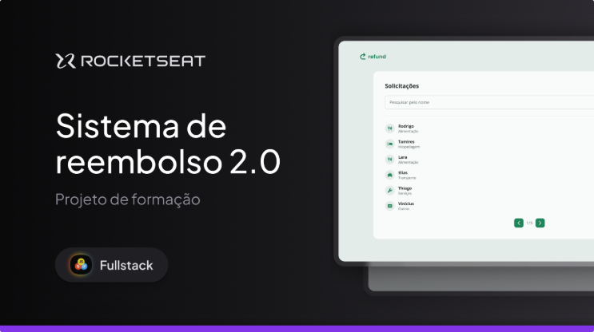

<p align="center">
  
</p>

<p align="center">
  <a href="#-projeto">Projeto</a>&nbsp;&nbsp;&nbsp;|&nbsp;&nbsp;&nbsp;
  <a href="#-tecnologias">Tecnologias</a>&nbsp;&nbsp;&nbsp;|&nbsp;&nbsp;&nbsp;
  <a href="#%EF%B8%8F-layout">Layout</a>&nbsp;&nbsp;&nbsp;|&nbsp;&nbsp;&nbsp;
  <a href="#licença-">Licença</a>
</p>

<p align="center">
  
  
  
  
  
  
  
  
</p>

---

<p align="center">
  
</p>

## 💻 Projeto

O **Refound** é uma aplicação **fullstack** para gestão de solicitações de reembolso.

O sistema simula um fluxo corporativo completo de solicitação, análise e aprovação de reembolsos, permitindo que usuários criem pedidos e administradores realizem a gestão dessas solicitações.

A aplicação conta com dois perfis de acesso:

- **Employee (Usuário)** → cria solicitações de reembolso
- **Manager (Administrador)** → visualiza, busca e gerencia solicitações

O projeto foi desenvolvido com foco em boas práticas de engenharia de software, incluindo separação de responsabilidades, reutilização de componentes e organização em **monorepo**, com frontend e backend desacoplados.

---

## 🌐 Acesso

🔗 **Frontend:** https://refund-2-0-gilt.vercel.app/
🔗 **API:** (em breve)

---

### ⭐ Funcionalidades principais

#### 🔐 Autenticação

- Cadastro de usuário
- Login com autenticação via token (JWT)
- Persistência de sessão (localStorage)
- Controle de acesso por perfil
- Rotas protegidas e fallback (Not Found)

#### 👤 Employee

- Criar solicitação de reembolso
- Selecionar categoria
- Inserir valor formatado
- Upload de comprovante
- Visualizar confirmação da solicitação

#### 🧑‍💼 Manager

- Visualizar solicitações em dashboard
- Buscar solicitações por nome
- Paginação de resultados
- Visualizar detalhes da solicitação
- Acessar comprovantes enviados

---

## 🚀 Tecnologias

#### Frontend (web)

- **React**
- **TypeScript**
- **Vite**
- **Tailwind CSS**
- **React Router**
- **Axios**
- **Zod**

#### Backend (api)

- **Node.js**
- **Express**
- **TypeScript**
- **Prisma ORM**
- **SQLite**

### Recursos aplicados

- Componentização e reutilização de UI
- Tipagem estática com TypeScript
- Gerenciamento de estado com Hooks (`useState`)
- Roteamento com separação por perfil de usuário
- Layouts reutilizáveis com `Outlet`
- Estilização com Tailwind (utility-first)
- Responsividade com breakpoints
- Organização modular de arquivos

---

## 🏗️ Arquitetura

Projeto estruturado como monorepo:

```bash
refund_2.0/
 ┣ web/   → Frontend (React)
 ┣ api/   → Backend (Node + Express)
```

---

## 🖼️ Layout

O layout foi construído com base em um design do Figma, com foco em:

- Interface limpa e moderna
- Hierarquia visual clara
- Consistência entre telas (Auth / App)
- Experiência responsiva (Desktop e Tablet)
- Componentes reutilizáveis
- Feedback visual para interações (hover, estados, loading)

---

## ⚙️ Configuração do Projeto

### Pré-requisitos

- Node.js instalado
- NPM ou Yarn

---

## 🔧 Instalação

```bash
# Clone o repositório
git clone https://github.com/williammilanez/refund_2.0.git

# Acesse a pasta
cd refund_2.0

# Instale dependências da raiz
npm install

# Instale dependências do frontend
cd web
npm install

# Volte e instale backend
cd ../api
npm install

# Volte para raiz
cd ..

# Execute
npm run dev
```

---

### Acessos locais

- Frontend: http://localhost:5173
- Backend: http://localhost:3333
- Prisma Studio: http://localhost:5555

---

## 📚 Aprendizados Aplicados

- Arquitetura fullstack (frontend + backend)
- Organização de projetos em monorepo
- Integração entre frontend e API
- Autenticação com JWT
- Upload e manipulação de arquivos
- Validação de dados com Zod
- Consumo de API com Axios
- Paginação e busca de dados
- Componentização e reutilização de UI
- Tipagem com TypeScript
- Boas práticas com Git (Conventional Commits)

---

## 👨‍💻 Autor

Projeto desenvolvido durante os estudos na **Rocketseat**  
Implementado por **William Milanez**

📍 Pós-graduação Dev Start – _Refund - Sistema de Reembolso_.

---

## Licença 📄

Este projeto está sob a licença **MIT**.  
Projeto de uso educacional e livre para fins de estudo e prática pessoal.

---
